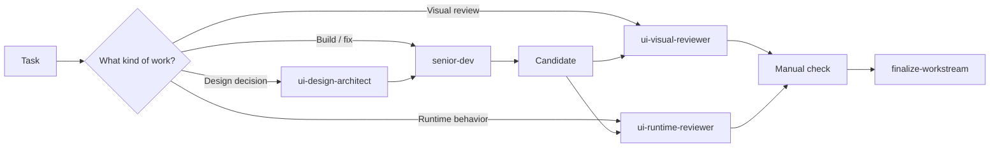

# CoMind Kit

> **Reusable Agent Skills and specialist agents for building, reviewing, and shipping software with AI coding tools.**


CoMind Kit packages a practical software-delivery workflow into portable Agent Skills that can be installed into supported AI coding runtimes.

It is **project-neutral by design**: the toolkit provides reusable workflows, while project-specific truth stays in the repository you are actually working on.

---

## Install

Use the normal `skills` CLI flow:

```bash
npx -y skills@1.5.22 add otis226/comind-kit
```

That keeps the CLI defaults for scope, skill selection, target runtimes, and installation method.

> Start here unless you specifically need runtime targeting or Claude Code specialist agents.

---

## What do you get?

| Area | What it helps with | Main skills |
|---|---|---|
| 🧭 **Engineering delivery** | Understand the task, plan, implement, coordinate subagents, control orchestration cost, hand off | `senior-dev`, `coding-agent-handoff`, `llm-resource-governor` |
| 🎨 **Product & UI** | Resolve design authority, critique UI, review visual quality | `ui-design-authority`, `ui-design-architect`, `product-ui-critique`, `ui-review`, `ui-visual-reviewer` |
| 🧪 **Verification** | Runtime checks, regression decisions, design parity, evidence | `ui-runtime-reviewer`, `runtime-regression`, `design-parity`, `pixel-parity-calibration`, `evidence-transport` |
| 🚢 **Finish & ship** | Final candidate checks, merge safety, cleanup | `finalize-workstream` |



---

## Skills at a glance

### 🧭 Build & orchestration

| Skill | Use it when | What it does |
|---|---|---|
| `senior-dev` | A feature, refactor, or bug fix is non-trivial | Main delivery owner: inspect → plan → implement → verify → handoff |
| `coding-agent-handoff` | Work can be split across coding agents | Defines vertical slices, ownership, return contracts, and final integration |
| `llm-resource-governor` | Work may spawn subagents, carry large context, use browser/MCP heavily, or run costly model sessions | Keeps fan-out earned, specialist context minimal, model selection explicit, reviewers short-lived, and evidence reusable |
| `finalize-workstream` | The candidate has been accepted and needs to ship | Resolves ship policy, merge safety, cleanup, and final status |

### 🎨 Design & product UI

| Skill | Use it when | What it does |
|---|---|---|
| `ui-design-authority` | Before meaningful UI implementation | Decides whether the work is reference-backed, system-backed, product-derived, or greenfield |
| `ui-design-architect` | The UI needs an independent design-authority pass | Produces a compact Design Manifest without editing production code |
| `product-ui-critique` | Reviewing an existing screen or screenshot | Diagnoses UX/visual/system issues while preserving what already works |
| `ui-review` | Reviewing UI against a design/system/product language | Chooses the right review mode and prioritizes actionable gaps |
| `ui-visual-reviewer` | After meaningful UI implementation | Independent PARITY / COHERENCE / DESIGN_QUALITY verdict |

### 🧪 Runtime, parity & evidence

| Skill | Use it when | What it does |
|---|---|---|
| `ui-runtime-reviewer` | UI behavior, state, navigation, forms, or async flows changed | Exercises the real candidate and returns PASS / FAIL / BLOCKED |
| `design-parity` | An exact design/reference is an acceptance target | Verifies visual, structural, interaction, business, and regression concerns |
| `pixel-parity-calibration` | Pixel mismatch remains after structural parity is close | Separates real product defects from fixture/clock/render noise |
| `runtime-regression` | A candidate changed after a previous runtime PASS | Decides what evidence still carries forward and what must be rerun |
| `evidence-transport` | Reviewers need screenshots, traces, reports, or diffs | Moves evidence to reviewable locations without polluting release history |

---

## Runtime support

| Runtime | Skills | Specialist agents |
|---|---:|---:|
| **Claude Code** | Yes | Optional plugin |
| **Cursor** | Yes | Runtime-native handling |
| **Codex** | Yes | Runtime-native handling |

The portable skills are the canonical workflows. Runtime-specific agents are thin adapters, not separate sources of truth.

---

## Claude Code specialist agents

The same workflows can also be exposed as isolated Claude Code subagents.

| Agent | Role | Typical use |
|---|---|---|
| `senior-dev` | Main engineering delivery owner | Own a substantial implementation from source inspection through handoff |
| `ui-design-architect` | Read-only design authority specialist | Resolve UI direction before implementation when design freedom is unclear |
| `ui-visual-reviewer` | Independent visual reviewer | Review the rendered candidate without trusting implementer rationale |
| `ui-runtime-reviewer` | Independent runtime reviewer | Exercise interactions, state, forms, navigation, and runtime health |
| `product-ui-critic` | Conservative product UI critic | Diagnose what should change — and explicitly preserve what should not |

The agent definitions are intentionally thin. **The canonical workflow stays in the skills**, so behavior is not duplicated across runtimes.

---

## Real workflows

### 1. Build a feature or fix a bug

```text
senior-dev
  → inspect current repository truth
  → classify risk and scope
  → apply llm-resource-governor when orchestration is expensive
  → implement directly or split vertical slices
  → targeted verification
  → visual/runtime review when relevant
  → READY FOR MANUAL CHECK
```

### 2. Implement or improve a UI screen

```text
ui-design-authority
  → ui-design-architect when design freedom is unclear
  → senior-dev implementation
  → ui-visual-reviewer
  → ui-runtime-reviewer when behavior changed
  → manual check
```

### 3. Match an exact design/reference

```text
design-parity
  → structural visual comparison
  → comparable-state check
  → pixel comparison when required
  → pixel-parity-calibration for residual noise
  → runtime/business/regression evidence
  → final verdict
```

Use exact parity only when an exact reference is genuinely an acceptance target. Do not create fake pixel gates for ordinary product-coherence work.

---

## Optional runtime targeting

<details>
<summary><strong>Claude Code only</strong></summary>

```bash
npx -y skills@1.5.22 add otis226/comind-kit --agent claude-code
```

</details>

<details>
<summary><strong>Cursor only</strong></summary>

```bash
npx -y skills@1.5.22 add otis226/comind-kit --agent cursor
```

</details>

<details>
<summary><strong>Claude Code + Cursor, all skills, global</strong></summary>

```bash
npx -y skills@1.5.22 add otis226/comind-kit --global --skill '*' --agent claude-code --agent cursor --yes
```

</details>

<details>
<summary><strong>Claude Code + Cursor + Codex, all skills, global</strong></summary>

```bash
npx -y skills@1.5.22 add otis226/comind-kit --global --skill '*' --agent claude-code --agent cursor --agent codex --yes
```

</details>

---

## Optional: Claude Code plugin + specialist agents

If you use Claude Code and want the specialist subagents in addition to the skills, run these commands **inside Claude Code**:

```text
/plugin marketplace add otis226/comind-kit
/plugin install comind-kit@otis-tools
```

The plugin loads the same canonical skills plus the five specialist agents listed above.

---

## How humans and AI should read this repo

**Humans:** start with this README to understand what is available and which workflow fits the task.

**AI maintainers:** start with `AGENTS.md` (Claude Code also sees `CLAUDE.md`). Installed runtimes use `SKILL.md`, optional `INSTRUCTIONS.md`, and runtime agent definitions as the operating instructions.

```text
README.md        → human orientation
AGENTS.md        → repository maintenance rules for AI
skills/*         → canonical reusable workflows
agents/*         → Claude Code specialist adapters
.claude-plugin/* → Claude Code distribution metadata
```

---

## Trust model

CoMind Kit provides workflow instructions, not project truth.

- Business rules, design decisions, API contracts, permissions, and release policy must come from the current project.
- A skill should not invent project-specific facts just because a reusable workflow mentions that concern.
- Review the repository before installing it into a sensitive environment, just as you would review any tool that can influence a coding agent.

---

## Versioning

Tagged releases follow Semantic Versioning. Before the first tag, `main` is the latest development line.

For reproducible automation, pin a tagged release or commit once tags are available instead of implicitly tracking `main`. See `CHANGELOG.md` for public changes and compatibility notes.

---

## Contributing & security

Contributions are welcome. Read `CONTRIBUTING.md` before changing a skill or agent, and run:

```bash
node scripts/validate-public.mjs
```

For sensitive reports involving secrets, private-data leakage, unsafe instructions, or supply-chain concerns, follow `SECURITY.md` instead of opening a public issue.

---

## Repository structure

```text
comind-kit/
├── README.md
├── AGENTS.md
├── CLAUDE.md
├── skills/                 # portable canonical Agent Skills
├── agents/                 # Claude Code specialist adapters
├── scripts/                # public self-validation
└── .claude-plugin/         # plugin + marketplace metadata
```

## License

MIT — see `LICENSE`.

